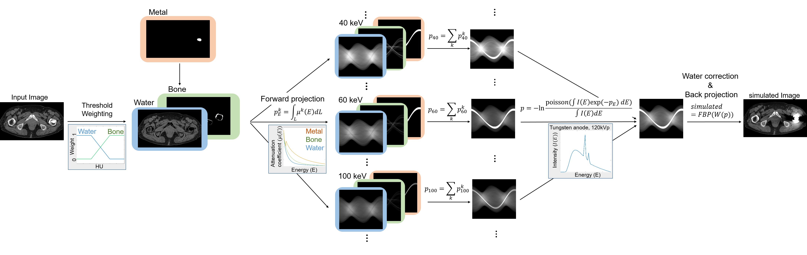
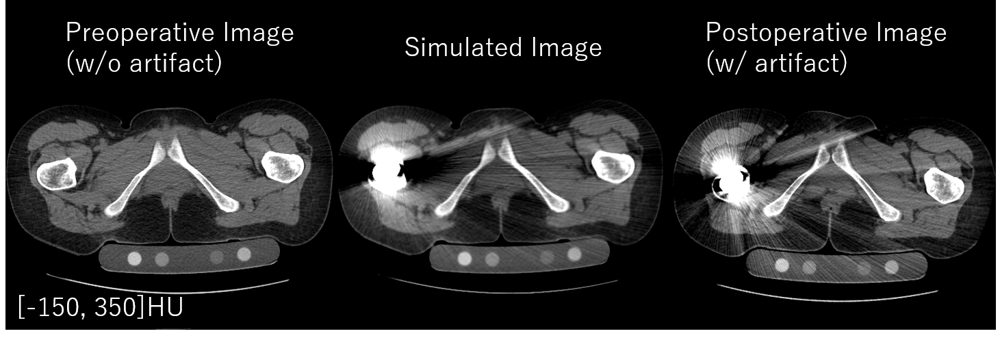
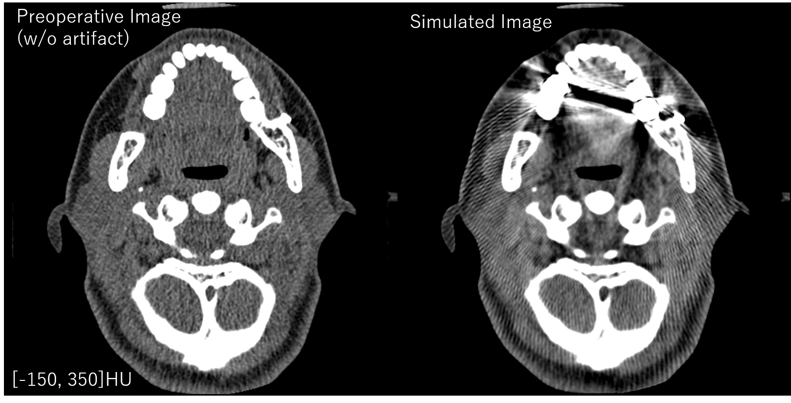

# Metal Artifact Simulation
MATLAB implementation of metal artifact simulation based on [1].  
We also introduced the water-based beam hardening correction [2] to reproduce the image similar to the one from common CT systems where a built-in calibration linearize the polychromatic x-ray projection.  

If you use this code, please consider citing:  

Sakamoto, M., Hiasa, Y., Otake, Y., Takao, M., Suzuki, Y., Sugano, N., & Sato, Y. (2019, March). Automated segmentation of hip and thigh muscles in metal artifact contaminated CT using CNN. In International Forum on Medical Imaging in Asia 2019 (Vol. 11050, p. 110500S). International Society for Optics and Photonics.

## Authors

Mitsuki Sakamoto <sakamoto.mitsuki.si2@is.naist.jp>  
Yoshito Otake <otake@is.naist.jp>  

## Requirements
[MATLAB](https://jp.mathworks.com/products/matlab.html)  
Also, please install [Image Processing Toolbox](https://jp.mathworks.com/products/image.html).  

We tested our code using MATLAB 2015a, 2018a and 2019a.  

## Test using sample data
You can test metal artifact simulation by running "simulation_demo.m".  
We prepared 2 images and corresponding metal labels of different parts in "sample data" directory.
The input and output images will be saved in "outputs" directory.

### Sample 1 (hip joint region)
In "sample_1.mat", a CT image of hip joint region and a corresponding metal label are contained.  
Below is the simulation result obtained using default settings.  
In addition to the preoperative (input) and the simulated (output) images, the postoperative CT image of the same patient is shown.  

### Sample 2 (head)
In "sample_2.mat", a CT image of head and a corresponding metal label are contained.  
Below is the simulation result obtained using default settings.  

  

## License
This project is licensed under the MIT License.  

## Reference
1. Zhang, Y., & Yu, H. (2018). Convolutional neural network based metal artifact reduction in X-ray computed tomography. IEEE transactions on medical imaging, 37(6), 1370-1381.

2. Herman, G. T. (1979). Correction for beam hardening in computed tomography. Physics in Medicine & Biology, 24(1), 81.
